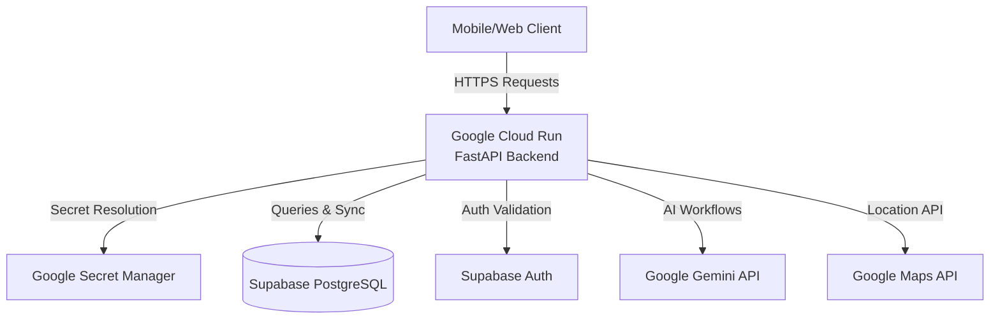

# Google Cloud Platform (GCP) Deployment Guide

This guide details how to deploy the **AI-Seekho Backend** to **Google Cloud Run**, integrated with **Google Secret Manager** and using your existing **Supabase PostgreSQL** database.

---

## Architecture Overview



- **Google Cloud Run:** Hosts the containerized FastAPI application. Serverless, automatically scales to zero when idle, and handles incoming HTTP/S traffic.
- **Google Secret Manager:** Securely stores environment secrets (`DATABASE_URL`, `SUPABASE_JWT_SECRET`, etc.). Cloud Run mounts these secrets at runtime as environment variables.
- **Supabase PostgreSQL:** Standard hosted Postgres instance. The backend communicates directly using SQLModel.
- **Google Artifact Registry:** Stores built Docker images.
- **Google Cloud Build:** Remotely builds the Docker image from local source code (no local Docker daemon required).

---

## Prerequisites

1. **Google Cloud SDK (`gcloud` CLI):**
   Ensure you have the Google Cloud SDK installed. You can download it [here](https://cloud.google.com/sdk/docs/install).

2. **Authenticate with GCP:**
   Open a terminal (Git Bash, WSL, or Command Prompt on Windows) and run:
   ```bash
   gcloud auth login
   gcloud auth application-default login
   ```

3. **GCP Project:**
   The scripts are pre-configured to deploy to the project ID: **`ai-seekho-2026-493917`**. Ensure your `gcloud` account has access to this project.

---

## Step-by-Step Deployment Instructions

### Step 1: Configure Your Local `.env` File
Make sure your local `backend/.env` is completely filled out with valid credentials. This is the source of truth used by the secret importer.

```ini
# backend/.env
DATABASE_URL=postgresql://...
SUPABASE_URL=https://...
SUPABASE_JWT_SECRET=...
GEMINI_API_KEY=...
GEMINI_MODEL=gemini-2.5-pro
GOOGLE_MAPS_API_KEY=...
```

### Step 2: Upload Secrets to Google Secret Manager
Run the secrets setup script. This script automatically enables the Secret Manager API, creates the required keys, and uploads the corresponding values from your local `.env`.

On Git Bash or WSL (from the project root):
```bash
bash backend/scripts/setup_secrets.sh
```

### Step 3: Build and Deploy to Cloud Run
Run the deployment script. It will enable required APIs, configure IAM permissions so Cloud Run can access Secret Manager, trigger a Cloud Build, and deploy to Cloud Run.

From the project root:
```bash
bash backend/scripts/deploy.sh
```

Once deployment is complete, the script will output the **Service URL** (e.g., `https://ai-seekho-backend-xxxxxx.a.run.app`).

---

## Modifying Secrets or Configuration

- **Secret Updates:** If you need to update a secret (like replacing a leaked API key or changing the database URL), update it in your local `backend/.env` and re-run:
  ```bash
  bash backend/scripts/setup_secrets.sh
  ```
  This creates a new version of the secret. Cloud Run automatically picks up the `latest` version on the next container spin-up (or you can force a redeployment).

- **Non-secret Configuration:** If you modify `backend/config.json` (such as scoring weights or agent timeouts), it is packaged directly inside the Docker image. Simply rebuild and redeploy the backend by running:
  ```bash
  bash backend/scripts/deploy.sh
  ```

---

## Troubleshooting

### 1. Permission Denied on Shell Scripts
If you get a permission error running the scripts, make them executable:
```bash
chmod +x backend/scripts/setup_secrets.sh
chmod +x backend/scripts/deploy.sh
```

### 2. Service Account Permissions (Secret Manager)
If your backend logs contain errors like `PermissionDenied` when trying to access secret values, ensure the default compute service account has the **Secret Manager Secret Accessor** role:
- Go to GCP Console → **IAM & Admin** → **IAM**.
- Find the member `<project-number>-compute@developer.gserviceaccount.com`.
- Verify it has the role **Secret Manager Secret Accessor**. The `deploy.sh` script automatically applies this, but it can be done manually in the console if needed.

### 3. Database Connection Issues
If the API fails to start up, double-check that the `DATABASE_URL` is pointing to the correct pooler or direct connection address for your Supabase Postgres, and that network rules/IP restrictions allow external connections (Supabase allows all connections by default if matching credentials are provided).
