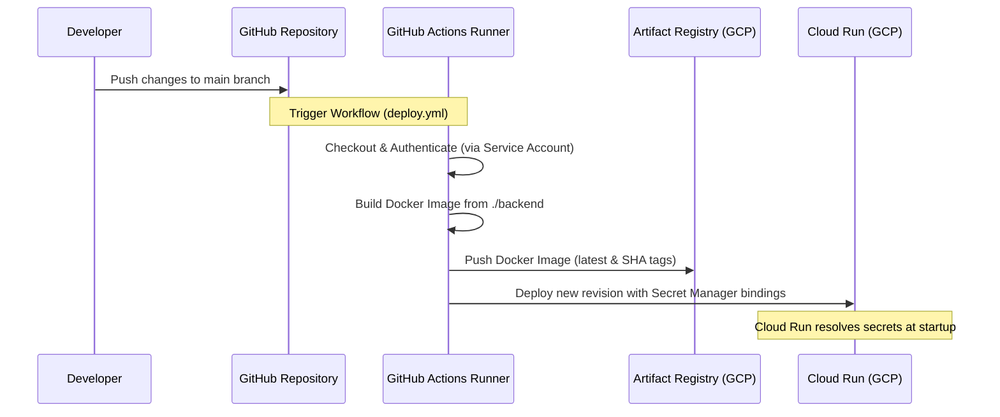

# Continuous Deployment from GitHub to Google Cloud

This guide provides a step-by-step walkthrough to set up **GitHub Actions** for automatically building and deploying the FastAPI backend to Google Cloud Run on every push to the `main` branch.

---

## Deployment Flow Overview



---

## Step 1: Create a GCP Service Account

To deploy from GitHub, you need to create a Service Account in your Google Cloud Project that acts as the "deployer".

1. Open the [Google Cloud Console](https://console.cloud.google.com/).
2. Navigate to **IAM & Admin** > **Service Accounts**.
3. Click **Create Service Account** at the top.
4. Fill in the details:
   - **Service account name:** `github-actions-deployer`
   - **Service account ID:** (auto-generated)
   - **Description:** `Service account used by GitHub Actions to deploy to Cloud Run.`
5. Click **Create and Continue**.

---

## Step 2: Assign IAM Roles to the Service Account

To allow GitHub Actions to build containers, push them, and deploy them, you must assign the following roles:

In the **Grant this service account access to project** screen, add the following roles:
1. **Cloud Build Editor** (`roles/cloudbuild.builds.editor`) — to trigger builds.
2. **Artifact Registry Writer** (`roles/artifactregistry.writer`) — to push built images to the registry.
3. **Cloud Run Developer** (`roles/run.developer`) — to deploy and manage Cloud Run revisions.
4. **Service Account User** (`roles/iam.serviceAccountUser`) — required to deploy resources associated with the default compute service account.

Click **Continue** and then **Done**.

---

## Step 3: Generate a JSON Key File

For authentication, download a JSON key file for the service account:

1. Click on the newly created `github-actions-deployer` service account in the list.
2. Go to the **Keys** tab.
3. Click **Add Key** > **Create new key**.
4. Select **JSON** format and click **Create**.
5. The JSON file will download automatically to your computer.
   
> [!CAUTION]
> Keep this file secure. **NEVER** commit this JSON key to Git, push it to a repository, or share it.

---

## Step 4: Configure GitHub Secrets

Store the JSON credentials securely in your GitHub repository:

1. Go to your repository on GitHub.
2. Click **Settings** (gear icon) > **Secrets and variables** > **Actions** (under Security).
3. Click **New repository secret**.
4. Enter the details:
   - **Name:** `GCP_SA_KEY`
   - **Value:** Open the downloaded JSON key file, copy the **entire** content, and paste it here.
5. Click **Add secret**.

---

## Step 5: Test the Pipeline

1. Ensure the [.github/workflows/deploy.yml](file:///g:/Hackathons/Google_Antigravity_hackathon/.github/workflows/deploy.yml) file is in your workspace.
2. Make a change in the `backend/` directory (for example, edit a comment or documentation).
3. Commit and push the changes to your `main` branch:
   ```bash
   git add .
   git commit -m "Configure GitHub Actions deployment"
   git push origin main
   ```
4. Navigate to your GitHub Repository and click on the **Actions** tab. You will see the **Deploy Backend to GCP Cloud Run** workflow executing.
5. Once complete, inspect the log for the "Deploy to Cloud Run" step to find the public URL of the deployed application.

---

## Step 6: (Optional) High-Security Setup: Workload Identity Federation

If you prefer **not** to manage long-lived service account JSON keys (recommended for production setups), you can configure **Workload Identity Federation (WIF)**. This allows GitHub Actions to authenticate via a short-lived OIDC token.

### 1. Set up WIF in GCP Console:
Run these commands in your Cloud Shell or local terminal to configure WIF:
```bash
# Create a Workload Identity Pool
gcloud iam workload-identity-pools create "github-pool" \
    --project="ai-seekho-2026-493917" \
    --location="global" \
    --display-name="GitHub Actions Pool"

# Create a Workload Identity Provider for GitHub
gcloud iam workload-identity-pools providers create-oidc "github-provider" \
    --project="ai-seekho-2026-493917" \
    --location="global" \
    --workload-identity-pool="github-pool" \
    --display-name="GitHub Provider" \
    --attribute-mapping="google.subject=assertion.subject,attribute.actor=assertion.actor,attribute.repository=assertion.repository" \
    --issuer-uri="https://token.actions.githubusercontent.com"

# Bind the service account to the federation pool
gcloud iam service-accounts add-iam-policy-binding "github-actions-deployer@ai-seekho-2026-493917.iam.gserviceaccount.com" \
    --project="ai-seekho-2026-493917" \
    --role="roles/iam.workloadIdentityUser" \
    --member="principalSet://iam.googleapis.com/projects/$(gcloud projects describe ai-seekho-2026-493917 --format='value(projectNumber)')/locations/global/workloadIdentityPools/github-pool/attribute.repository/YOUR_GITHUB_ORGANIZATION/YOUR_REPO_NAME"
```

### 2. Update GitHub Actions Steps:
Replace the **Google Auth** step in `.github/workflows/deploy.yml` with:
```yaml
      - name: Google Auth (Workload Identity Federation)
        uses: google-github-actions/auth@v2
        with:
          workload_identity_provider: 'projects/PROJECT_NUMBER/locations/global/workloadIdentityPools/github-pool/providers/github-provider'
          service_account: 'github-actions-deployer@ai-seekho-2026-493917.iam.gserviceaccount.com'
```
*(Replace `PROJECT_NUMBER` with your actual GCP project number).*
